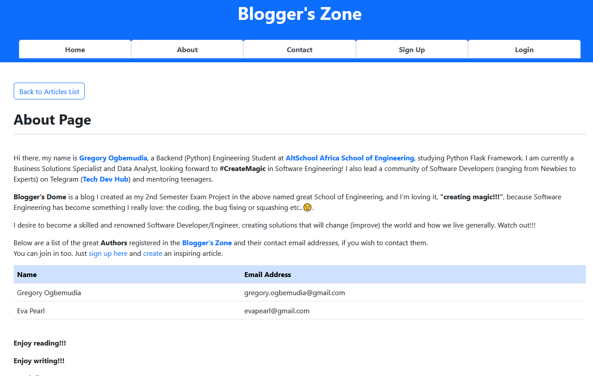
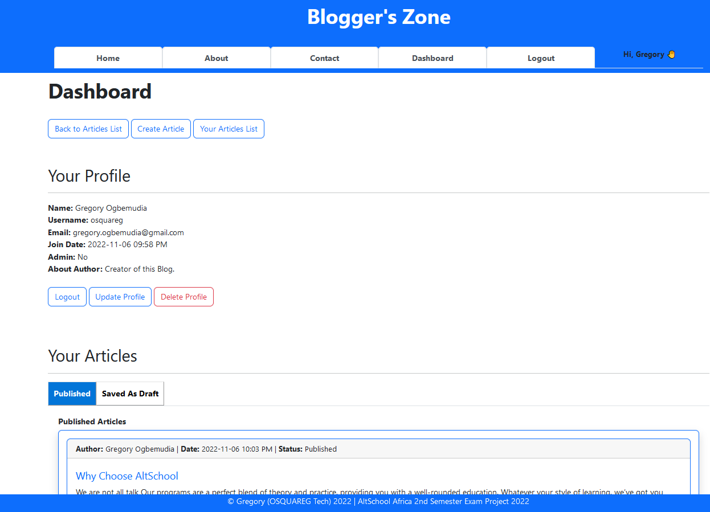

# **THE BLOGGER'S ZONE**

## **Table of Content**

1. Introduction
2. Packages Installed/Used
3. Design/Specifications
4. User Authentication
5. User Authorization
6. What I Learnt
7. How to Run it Locally
8. Screenshots Sample

## 1. Introduction

**Blogger's Zone** is an exam project created and designed by [Gregory Ogbemudia](https://github.com/OSQUAREG), a student of [AltSchool Africa School of Software Engineering](https://thealtschool.com/software-engineering/) in Backend (Python) Engineer, already creating magic using Flask framework!

This documentation sets to introduce and give you details of the design features of the Blogger's Zone.

The **Blogger's Zone** is a blog site where both authors and readers can explore the thoughts and minds of others,
while getting inspired to write as well. In this Blog, you enjoy reading, enjoy writing and touch lives.

## 2. Design/Specifications

This Blog have the following pages:

### A) Main (General) Page/Menu

These comprise Home Page (which lists only published articles and authors), About Page, Contact Page and View Single
Article Page, visible to everyone.

#### i) Home Page

* This page has button links to Sign-Up or Login (when not logged in) but has button links to "create articles" and "view your dashboard".
* It has list of only published articles and authors.

#### ii) About Page

* This page tells about the creator and the blog.
* In addition, it has the list of authors and their email.

Contact Page

### B) Auth Pages/Menu

These are the Sign-Up and Login Pages, only visible when you are not logged in.

### C) User Pages/Menu

These are pages and menus only logged users have access to. They include the Dashboard Page, Logout Menu, Create Article Page, Edit Article Page, Update Profile Page.

## 3. Packages Installed/Used

The main packages that were pip installed are:

* Flask
* Flask-CKEditor
* Flask-Login
* Flask-SQLAlchemy
* Flask-WTF

## 4. User Authentication

### A) Authentication Category

There are 2 main category of access to this Blog:

#### i) Contributors

These consists of **Authors** and **Commenters** are required to sign up and login with their account to be able to create, save or publish, edit and delete their articles.

#### ii) Viewers/Readers

However, **Viewers/Readers** can only view or read articles only published articles on the Home Page of this Blog. They can also view comments but cannot drop comments or write an article.

### B) Authentication Processes

#### i) Sign Up Process:

* Every user must have a first name, last name, username (unique), email (unique) and a password to sign up using the Sign-Up Page to become a contributor. Also, 'About Author' field is optional.

#### ii) Login Process:

* Every contributor can either log in using a unique "username" (or a unique "email") and password.

*NOTE: the passwords are hashed before they are saved on the database*

## 5) User Authorization

Below are various implemented authorizations level on this Blog:

### A) Articles

#### i) Creating, Saving and Publishing Articles

Only contributors can create and either "save as draft" or publish articles on this blog. Saved articles can only be accessed by their authors and then, can still edit or publish them.

#### ii) Viewing/Reading Articles

All contributors and viewers can view/read all published articles on the Home Page.

#### iii) Editing and Deleting Articles

Only the author of an article can edit or delete the article, either saved or published.

#### iv) Viewing and Adding Comments

All can view comments by others but only contributors can add comments to an article.

### B) Users

#### i) User Dashboard

Only logged-in users can see their own dashboard, which has 2 sections namely; Your Profile and Your Articles
(published and saved as draft).

###### a. Your Profile section

Here, only logged-in users have button links to:

* update their profile
* delete their profile
* log out of their session

###### b. Your Article section

Logged-in users only see their articles, which are displayed under 2 separate tabs:

* Published
* Saved As Draft

Here, they also have buttons links to either create, view, edit, delete their articles.

## 6) What I Learnt

On this project, below are a list of what I learnt:

* Routing
* User Authentication
* User Authorization
* Debugging
* Web Design
* Using Bootstrap CSS & JavaScripts
* Database Management
* Using Flash Message
* Documentation

## 7) How to Run it Locally

### a) Prerequisites

Python 3

### b) Installation

Run the below steps on the terminal.

#### i) Clone this Repository

```
$ git clone https://github.com/OSQUAREG/Blogger-Zone.git
```

#### ii) Activate the Virtual Environment

```
$ source venv/Scripts/activate
```

#### iii) Install the Project Packages

```
$ pip install -r requirements.txt
```

#### iv) Run App on Terminal

```
$ python app.py
```

#### v) Run App on Browser

On the terminal, copy the generated link and paste on your browser to access the application.

## 8) Acknowledgments

* [AltSchool Africa School of Software Engineering](https://thealtschool.com/software-engineering/)
* [StackOverflow](https://stackoverflow.com/)
* [Caleb Emelike](https://github.com/CalebEmelike)
* [Codemy.com](https://www.youtube.com/c/Codemycom)

## 9) Screenshots Samples

#### a) Home Page


#### b) Home Page (Logged in User)


#### c) Sign Up Page


#### d) Login Page


#### e) About Page



#### f) Contact Page


#### g) Single Article View Page (with Comments)


#### h) User Dashboard



#### i) User Article List on Dashboard


#### j) Create Article Page


#### k) Update Profile


## 10) Conclusion

It was worth the while to have engaged on this project, and it has helped to improve my Backend skills in Flask framework and exploring its related packages.

Contact or collaborate with me on:

* [GitHub](https://github.com/OSQUAREG)
* [Twitter](https://twitter.com/OSQUAREG)
* [Replit](https://replit.com/@OSQUAREG)
* [LeetCode](https://leetcode.com/OSQUAREG/)

Thanks, AltSchool Africa for this opportunity!

Let's continue to #CreateMagic!
